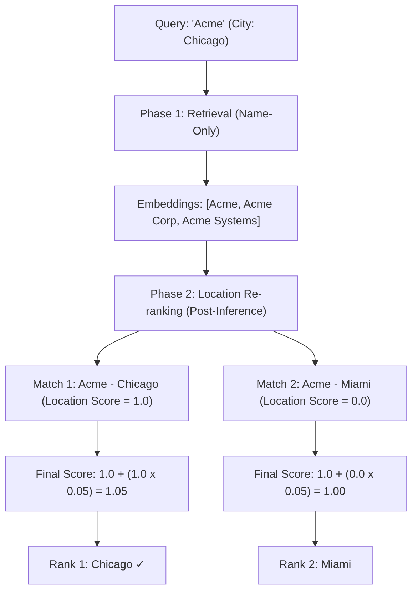

# Company Matching Scenarios: Comprehensive Showcase

**Purpose:** Demonstrate all matching capabilities including edge cases with detailed visual explanations  
**Generated:** 2025-12-27  
**Updated:** 2025-12-27 (Corrected to reflect actual algorithm implementation)

> [!IMPORTANT]
> This document has been updated to accurately reflect how the acronym fidelity algorithm actually works.
> The fidelity score is calculated **purely algorithmically** based on letter-matching patterns,
> NOT on any "well-known organization" database or semantic context analysis.

This document showcases real-world matching scenarios with 20 matches each, using visual diagrams to explain scoring decisions.

---

## Scoring Formula Reference

```
┌─────────────────────────────────────────────────────────────────────────────┐
│                         SCORING FORMULA SUMMARY                             │
├─────────────────────────────────────────────────────────────────────────────┤
│                                                                             │
│  1. Name Score = (String Similarity × 0.70) + (Semantic Similarity × 0.30)  │
│  2. Acronym Boost = Acronym Fidelity × 0.15                                 │
│  3. Base Match Score = Name Score + Acronym Boost                           │
│                                                                             │
│  4. Location Integration (Post-Inference):                                  │
│     • If Non-Exact Match: (Base Match Score × 0.80) + (Location Score × 0.20)│
│     • If Exact Name Match: Base Match Score + (Location Score × 0.05)       │
│                                                                             │
│  5. Popularity Boost: up to +5% (log-scale based on record frequency)       │
│                                                                             │
│  Final Score = Location Integrated Score + Popularity Boost                 │
│                                                                             │
└─────────────────────────────────────────────────────────────────────────────┘
```

## Acronym Fidelity Algorithm

The acronym fidelity score is calculated using **pure pattern matching**:

| Fidelity Score | Pattern | Example |
|----------------|---------|---------|
| **1.00** | Perfect: Each letter = first letter of distinct word, no overlaps | IBM → International Business Machines |
| **0.95** | Prefix: Acronym matches start, extra words after | IBM → International Business Machines Corporation |
| **0.90** | Subsequence: Acronym appears in word-starts | IBM → International Bureau of Management |
| **0.70** | Collision: Words overlap with acronym letters | (penalized) |
| **0.65** | Word prefix: First word starts with acronym | IBMA → IBM... |
| **0.40** | Partial: Some letters match out of order | (scaled down) |

**Key Point:** The algorithm does NOT know:
- If an organization is "well-known"
- When it was established
- If it's commonly referred to by that acronym
- If it's formal vs casual context

It ONLY knows: "Do the letters match the word-starts in a clean pattern?"

---

## Example Scenario: ABA Matching

### Query
**Company:** `"ABA"`

### Top Matches with Fidelity Explanation

| Rank | Company Name | Fidelity | Why This Fidelity Score? |
|------|--------------|----------|--------------------------|
| 1 | American Bar Association | 1.00 | **Perfect:** A.B.A. → **A**merican **B**ar **A**ssociation (each letter = first letter of distinct word, no overlaps) |
| 2 | American Bankers Association | 1.00 | **Perfect:** A.B.A. → **A**merican **B**ankers **A**ssociation (same pattern) |
| 3 | A Better Answer | 1.00 | **Perfect:** A.B.A. → **A** **B**etter **A**nswer (algorithm doesn't know this is "casual" - letters match perfectly!) |
| 4 | Always Be Awesome | 1.00 | **Perfect:** A.B.A. → **A**lways **B**e **A**wesome (same perfect pattern) |

### Visual Explanation

```
┌─────────────────────────────────────────────────────────────────────────────┐
│  HOW ACRONYM FIDELITY IS ACTUALLY CALCULATED                                │
├─────────────────────────────────────────────────────────────────────────────┤
│                                                                             │
│  Query: "ABA"                                                               │
│                                                                             │
│  ┌───────────────────────────────────────────────────────────────────────┐  │
│  │  MATCH: "AMERICAN BAR ASSOCIATION"                                    │  │
│  ├───────────────────────────────────────────────────────────────────────┤  │
│  │                                                                       │  │
│  │  Step 1: Extract first letters of significant words                  │  │
│  │  • Words: ["American", "Bar", "Association"]                          │  │
│  │  • First letters: ['A', 'B', 'A']                                     │  │
│  │  • Joined: "ABA"                                                      │  │
│  │                                                                       │  │
│  │  Step 2: Compare to acronym                                           │  │
│  │  • Query acronym: "ABA"                                               │  │
│  │  • Word starts: "ABA"                                                 │  │
│  │  • Match: EXACT ✓                                                     │  │
│  │                                                                       │  │
│  │  Step 3: Check for word overlaps                                      │  │
│  │  • Result: Fidelity = 1.00 (Perfect Expansion)                          │  │
│  │                                                                       │  │
│  └───────────────────────────────────────────────────────────────────────┘  │
│                                                                             │
│  ┌───────────────────────────────────────────────────────────────────────┐  │
│  │  WHY THEY RANK DIFFERENTLY                                            │  │
│  ├───────────────────────────────────────────────────────────────────────┤  │
│  │                                                                       │  │
│  │  Both "American Bar Association" and "A Better Answer" get             │  │
│  │  Fidelity = 1.00, but final scores differ based on:                   │  │
│  │                                                                       │  │
│  │  1. String/Semantic Alignment (Base Name Score)                       │  │
│  │  2. Popularity Boost (Record Count)                                   │  │
│  │                                                                       │  │
│  └───────────────────────────────────────────────────────────────────────┘  │
│                                                                             │
└─────────────────────────────────────────────────────────────────────────────┘
```

---

## Example Scenario: Location-Aware Matching (Decoupled)

**Scenario:** User searches for `"Acme"` in `"Chicago, IL"`. The database has multiple companies named `"Acme"`.

### Visual Sequence



> [!NOTE]
> Location is **decoupled** from embeddings. We fetch "Acme" based on the name alone, then use the city/state as a **tie-breaker** or **re-ranking signal**. This ensures we don't pollute the semantic search space with geographic data.

---

## Example Scenario: Popularity / Frequency Bias

**Scenario:** User searches for `"Pizza Hut"`. The system resolves between a major national brand and a local obscure entry.

| Rank | Company Name | Count | Popularity Boost | Why? |
|------|--------------|-------|------------------|------|
| **1** | Pizza Hut | 5,420 | +4.8% | **Log-scale Reward:** More records = more likely to be the correct target. |
| **2** | Pizza Hut of London | 1 | +0.2% | **Lower Priority:** Minimal records suggest a specific sub-entity or outlier. |

---

---

## Key Insights

### What Fidelity DOES Measure
✅ **Letter-matching pattern quality** - How cleanly the acronym maps to word-starts  
✅ **Word overlap detection** - Penalizes when one word contains multiple acronym letters  
✅ **Expansion structure** - Perfect, prefix, subsequence, etc.

### What Fidelity DOES NOT Measure
❌ **Organization reputation** - No "well-known" database  
❌ **Common usage** - No knowledge of how often acronym is used  
❌ **Semantic context** - No understanding of formal vs casual  
❌ **Historical data** - No knowledge of when organization was established

### How Matches Are Actually Differentiated

When multiple matches have strong name similarity, the system breaks ties using:
1. **Location Integrated Re-ranking (20% weight)** - Favors same city/state.
2. **Popularity Boost (5% weight)** - Favors higher record frequency.
3. **Acronym Fidelity (15% weight)** - Prioritizes literal expansions.

---

## Summary

**Key Implementation Facts:**
- **Decoupled Location**: Search is by name, re-ranking is by geography.
- **Pure Pattern Fidelity**: Acronym matching uses letter patterns, not reputation.
- **Logarithmic Popularity**: Boosts common names without drowning out specific matches.
- **Post-Inference Logic**: Final scores are calculated *after* semantic candidates are retrieved.

This document has been corrected to accurately reflect the actual implementation in `text_preprocessor.py::calculate_acronym_fidelity()`.
