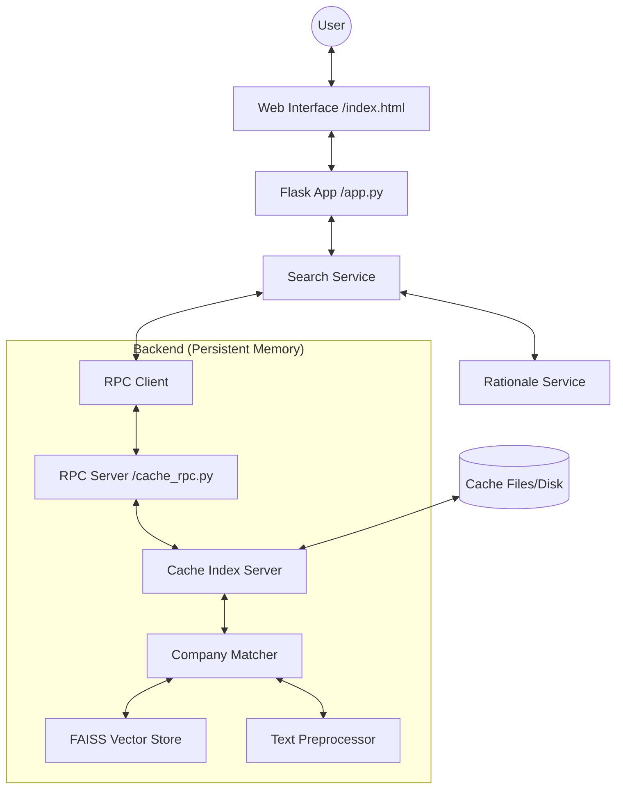

# FineTuner Project Context Digest

This document provides a comprehensive overview of the FineTuner project, intended for high-level analysis in tools like NotebookLM.

## 1. Project Overview
FineTuner is a high-performance company matching and entity resolution system. It is designed to match messy query strings (e.g., from user input or search results) against a master database of 4.3 million entities. The system provides transparency through detailed "match rationales" that explain why a result was chosen.

## 2. Core Architecture
The system uses a persistent RPC-based cache server to hold large FAISS indexes and semantic embeddings in memory, allowing for sub-second search times across millions of records.

## 3. Key Components

### A. Core Engine (`src/finetuner/core/`)
*   **`matcher.py` (The Brain):** Implements the hybrid matching algorithm. 
    *   **Phase 0 (Acronyms):** Fast expansion/reverse check for abbreviations (O(1)).
    *   **Phase 1 (Retrieval):** FAISS-based semantic search for top candidate retrieval.
    *   **Phase 2 (Re-ranking):** Weighted scoring (50% Lexical, 25% Semantic, 25% Concept Alignment).
    *   **Phase 3 (Exact Match):** **(Optimized)** Instant dictionary lookup for identical names across 4.3M entries.
*   **`vector_store.py`:** Wrapper for the FAISS index and embedding storage.
*   **`text_preprocessor.py`:** Handles cleaning, normalization, acronym generation, and location scoring (City/State analysis).
*   **`cache_rpc.py` & `cache_server.py`:** The infrastructure layer that keeps the 6.6GB index in memory across app restarts.

### B. Web Layer (`src/finetuner/web/`)
*   **`app.py`:** Flask entry point handling routes for search and status.
*   **`search_service.py`:** Orchestrates the flow between the web UI and the RPC backend. Includes resilience features like the **10-second RPC timeout**.
*   **`rationale_service.py` (Explanation Engine):** Converts sterile scores into deep narrative insights.
    *   Generates "Verdict Banners" (EXCELLENT, STRONG, etc.).
    *   Explains "Relationship types" (Acronym, Substring, Pure Semantic).
    *   Provides "Evidence Analysis" with descriptive interpretations.

## 4. Proprietary Scoring Logic
Matches are scored using a composite formula:
1.  **String Similarity (50%):** Character-level overlap (Levenshtein/Custom Weighted).
2.  **Semantic Similarity (25%):** Vector distance (all-MiniLM-L6-v2 embeddings).
3.  **Concept Alignment (25%):** "Common sense" filter using "Concept Signatures" to ensure industry/category alignment.
4.  **Boosts:** 
    *   **Acronym Fidelity:** Up to +15% for literal expansions.
    *   **Location Boost:** Up to +20% for geographic confirmation.
    *   **Popularity/Frequency:** Up to +5% for common/trusted entities.

## 5. Recent Performance Optimizations
*   **O(1) Exact Matching:** Replaced a linear scan of 4.3M records with a dictionary-based index lookup, fixing a critical hang issue.
*   **Multi-Index Support:** The system now handles entities with the same name across multiple locations (e.g., thousands of "IBM" branches) without performance degradation.
*   **Concurrency Resilience:** Added RPC timeouts to ensure the Web UI never hangs permanently even under heavy server load.

## 6. Development Workflows
The project includes several CLI-based automation tools:
*   `/verify`: Runs the matching logic against a 400+ record control set.
*   `/debug`: Interactive tool to inspect a specific company match in depth.
*   `generate_ultra_report.py`: Produces the high-fidelity Markdown reports used for SME validation.

---
*Created on 2026-01-02 to facilitate deep contextual analysis.*
