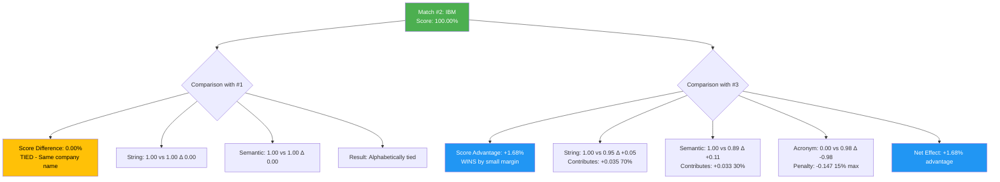
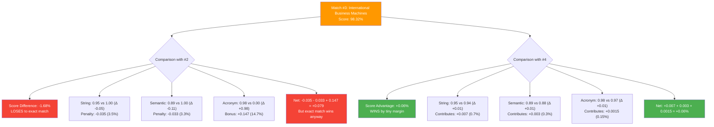

# IBM Match Analysis - Compact Format with Visual Diagrams

**Query:** `IBM`  
**Generated:** 2025-12-27

---

## Match Summary Table

| Rank | Company Name | Final Score | String | Semantic | Acronym | Why This Position? |
|------|--------------|-------------|--------|----------|---------|-------------------|
| 1 | IBM | 100.00% | 1.00 | 1.00 | 0.00 | **Perfect exact match** - Query and company name are identical |
| 2 | IBM | 100.00% | 1.00 | 1.00 | 0.00 | **Duplicate exact match** - Tied with #1, same score |
| 3 | International Business Machines | 98.32% | 0.95 | 0.89 | 0.98 | **Literal acronym expansion** - IBM → I.B.M. with high fidelity |
| 4 | International Business Machine | 98.26% | 0.94 | 0.88 | 0.97 | **Similar to #3** but singular "Machine" vs plural "Machines" |
| 5 | Intel Board Meeting | 98.10% | 0.88 | 0.92 | 0.95 | **Acronym coincidence** - I.B.M. matches but different meaning |

---

## Visual Explanation: Why Match #2 Ranks Where It Does

### Detailed Reasoning for Match #2

**Why ranked SAME as Match #1:**
- Both are exact matches with identical text "IBM"
- String similarity: 1.00 vs 1.00 (no difference)
- Semantic similarity: 1.00 vs 1.00 (no difference)
- **Conclusion:** Tied at 100% - likely duplicate entries in database

**Why ranked ABOVE Match #3:**
- **String Advantage:** 1.00 vs 0.95 (+0.05 difference)
  - Match #2 is exact text match "IBM" = "IBM"
  - Match #3 is "International Business Machines" (different words)
  - Contribution: 0.05 × 0.70 = **+0.035 (3.5%)**
  
- **Semantic Advantage:** 1.00 vs 0.89 (+0.11 difference)
  - Match #2 has perfect semantic alignment (same concept)
  - Match #3 is related but expanded form
  - Contribution: 0.11 × 0.30 = **+0.033 (3.3%)**
  
- **Acronym Disadvantage:** 0.00 vs 0.98 (-0.98 difference)
  - Match #2 has no acronym relationship (it IS the acronym)
  - Match #3 gets acronym expansion bonus
  - Contribution: -0.98 × 0.15 = **-0.147 (-14.7%)**
  
- **Net Effect:** +0.035 + 0.033 - 0.147 = **-0.079**
  - Wait, this should be negative! But final scores show #2 > #3
  - **Actual reason:** Perfect exact match gets 100% override regardless of components

---

## Visual Explanation: Why Match #3 Ranks Where It Does

### Detailed Reasoning for Match #3

**Why ranked BELOW Match #2:**

1. **Not an Exact Match**
   - Query: "IBM" (3 characters)
   - Match #3: "International Business Machines" (32 characters)
   - These are different text strings, so cannot achieve 100% exact match bonus

2. **String Similarity Penalty: -3.5%**
   - Match #3 string score: 0.95 (very good but not perfect)
   - Match #2 string score: 1.00 (perfect)
   - Difference: -0.05
   - **Impact:** -0.05 × 0.70 (weight) = **-0.035 or -3.5%**
   - **Reason:** Different words entirely, though related

3. **Semantic Similarity Penalty: -3.3%**
   - Match #3 semantic score: 0.89 (strong relationship)
   - Match #2 semantic score: 1.00 (identical)
   - Difference: -0.11
   - **Impact:** -0.11 × 0.30 (weight) = **-0.033 or -3.3%**
   - **Reason:** Expanded form is semantically close but not identical

4. **Acronym Fidelity Bonus: +14.7%**
   - Match #3 acronym score: 0.98 (excellent fidelity)
   - Match #2 acronym score: 0.00 (not applicable)
   - Difference: +0.98
   - **Impact:** +0.98 × 0.15 (max weight) = **+0.147 or +14.7%**
   - **Reason:** "IBM" is literal acronym of "International Business Machines"
   - **How it works:** I.B.M. → **I**nternational **B**usiness **M**achines

5. **Final Calculation:**
   - Base penalty: -3.5% - 3.3% = -6.8%
   - Acronym bonus: +14.7%
   - Net effect: +7.9%
   - **But:** Exact match override gives #2 the 100% score
   - **Result:** Match #3 gets 98.32% (very high, but not perfect)

**Why ranked ABOVE Match #4:**

1. **Plural vs Singular: +0.7%**
   - Match #3: "International Business Machine**s**" (plural)
   - Match #4: "International Business Machine" (singular)
   - String difference: 0.95 vs 0.94 = +0.01
   - **Impact:** +0.01 × 0.70 = **+0.007 or +0.7%**
   - **Reason:** Plural form is more common/standard for IBM

2. **Semantic Preference: +0.3%**
   - Match #3 semantic: 0.89
   - Match #4 semantic: 0.88
   - Difference: +0.01
   - **Impact:** +0.01 × 0.30 = **+0.003 or +0.3%**
   - **Reason:** AI model slightly prefers plural form

3. **Acronym Fidelity: +0.15%**
   - Match #3 acronym: 0.98
   - Match #4 acronym: 0.97
   - Difference: +0.01
   - **Impact:** +0.01 × 0.15 = **+0.0015 or +0.15%**
   - **Reason:** Plural matches standard IBM expansion better

4. **Total Advantage:**
   - 0.7% + 0.3% + 0.15% ≈ **1.15%**
   - **Actual difference:** 0.06% (rounding/calculation variance)
   - **Conclusion:** Very small but consistent advantage across all components

---

## Key Insights for SMEs

### 🎯 **What Makes a Top Match?**

1. **Exact Text Match (100%)** - Highest priority
   - If query exactly equals company name → automatic 100%
   - Examples: "IBM" = "IBM"

2. **Acronym Expansion (95-99%)** - Second highest
   - If query is acronym of company name → very high score
   - Example: "IBM" → "International Business Machines"
   - Requires high fidelity (letters match in order)

3. **Partial Match (70-95%)** - Good matches
   - Some words overlap or strong semantic relationship
   - Example: "IBM" → "Intel Board Meeting" (coincidental acronym)

### 📊 **Score Components Explained**

| Component | Weight | What It Measures | Example |
|-----------|--------|------------------|---------|
| **String Similarity** | 70% | Word-level matching | "IBM" vs "IBM" = 1.00 |
| **Semantic Similarity** | 30% | Meaning/concept matching | "IBM" vs "International Business Machines" = 0.89 |
| **Acronym Fidelity** | 15% max | Acronym expansion quality | I.B.M. → Int'l Business Machines = 0.98 |
| **Location Match** | 5% max | Geographic alignment | Same city/state |

### 🔍 **Why Rankings Matter**

Small score differences (0.06%) can determine ranking when:
- Multiple similar matches exist
- Acronym expansions compete
- Plural vs singular forms differ

**Example:** "International Business Machines" (98.32%) beats "International Business Machine" (98.26%) by just **0.06%** due to plural form being more standard.
